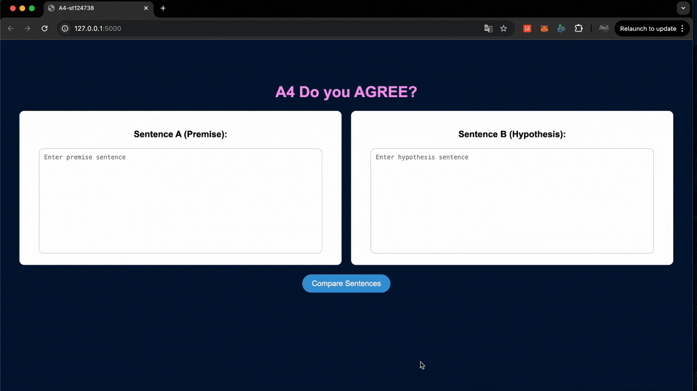
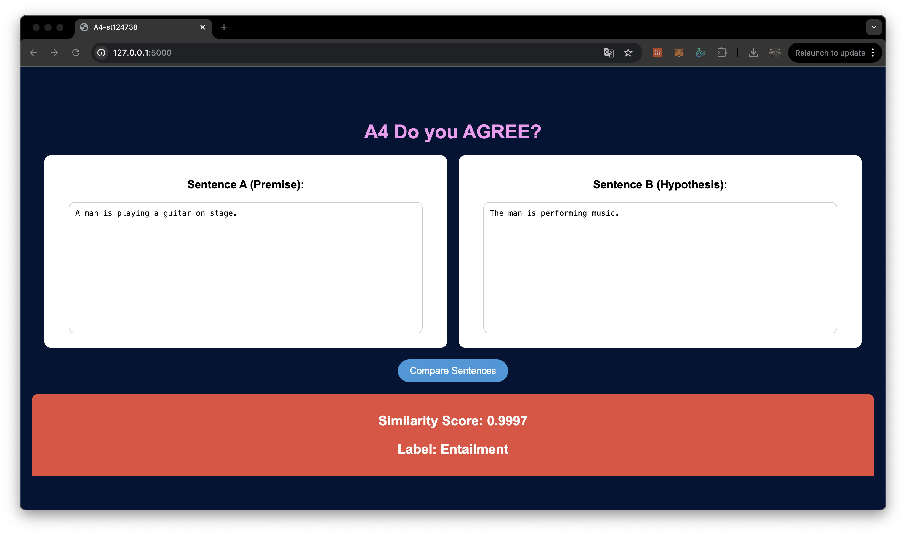

# A4-Do-you-AGREE : 
## st124738
## Sonakul kamnuanchai

## Citation data source for model original (Bert)
- Dataset BookCorpus : https://huggingface.co/datasets/bookcorpus/bookcorpus 
- Using 1% of entire dataset = 740042

##  Evaluation and Discussion on Model 2 (Sentence-Bert)
| Model Type          | SNLI + MNLI, Performance (Accuracy)|
|---------------------|-----------|
| S-BERT            | 35.30%   |

- In this section, we present the performance of the Sentence-bert model by training with 4 epoches, which was trained on a combined dataset of SNLI and MNLI. The model was evaluated on both matched and mismatched sentence pairs, resulting in an accuracy of 35.30%.
- Model Architecture: The model use a 12-layer BERT-based architecture with 12 attention heads per layer and an embedding size of 768 with a learning rate of 2e-5 and batch size of 32
- Loss Function: SoftmaxLoss is used for classification, where the output is calculated using cosine similarity between sentence embeddings.

### Challenges Encountered During the Implementation:
- The model achieved only 35.30% accuracy. This suggests underfitting, where the model might not be complex enough or has not been trained sufficiently.
- Mismatched pairs with combineing SNLI and MNLI dataset add complexity, which might have hindered learning. The model may require more sophisticated tokenization or architectural adjustments to handle these cases better.

### Potential Improvements or Modifications:
-  Experiment with a smaller learning rate, increase batch size, or increase the number of epochs for training. Fine-tuning the model hyperparameters could help overcome underfitting and improve performance.

## How to run the application:
- Step1 : Download model files from this link : https://drive.google.com/drive/folders/1Lh0tBunxUiue6FRi9HuAZfi5RjXHG_c1?usp=sharing
- Step2 : Move s_bert_model.pth into model/
- Step3 : python app.py

## Video demo in web application

## Output sample in web application

